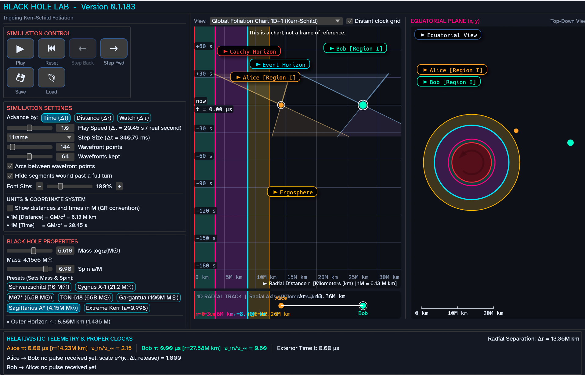
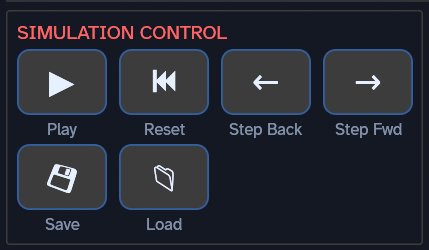
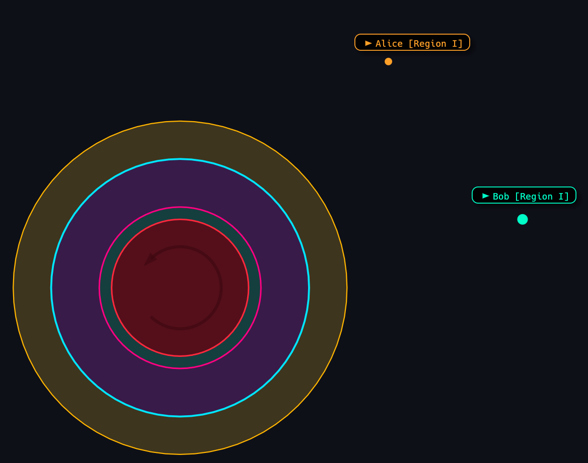

## Introduction

Black Hole Lab is a physics simulation of a rotating black hole and two
observers, Alice and Bob.  You can launch Alice and Bob on paths around or into
the black hole and watch events play out.  The simulation let's you see a slice
of the physics with one or two dimensions of space plus one of time.  Alice and
Bob also have a beacon that transmits a radio wave in all directions.  The
simulation calculates and shows the wavefront of these signals, accounting for
the warping of space and time by the black hole.  The simulation also records
whenever Alice and Bob receive a signal from the other.

The simulation takes pains to respect Einstein's equations of general
relativity.  To a double-floating point degree of accuracy, the effects shown in
Black Hole Lab are really what the math of general relativity says will happen.
While the predictions of general relativity have been proven correct countless
times, physicists agree that general relativity *cannot* be the final word on
black holes.  Nobody knows yet what would *actually* happen to Alice and Bob
inside a black hole!

## Starting Up

Black Hole Lab divides the screen into 3 parts.  On the left are most of the
settings.  In the middle is the selectable frame of reference (FoR) view or the
global "foliation" chart.  On the right is the 2 dimensional equatorial view.

## Basic Controls

To start, click **Play** in the top left.  You'll see Alice and Bob start moving
and broadcasting the their signal.  By default, Alice orbits the black hole
while Bob takes a rather uninteresting plunge inward.

Click **Reset** to return the simulation to its starting point.  You can also
play/pause the simulation with the space bar.  The keyboard arrow keys **single
step** the simulation forward and backward in time.

You can also save and load your simulation using the associated buttons.

## The Equatorial Plane View

The right hand side shows a top-down map of the black hole and surrounding
space.  The black hole looks like a colored bullseye while Alice and Bob are the
yellow and turquoise dots respectively.  The black hole spins counter-clockwise.

### The Black Hole Ergosphere

The outermost yellow region of the black hole is the *ergosphere*.  A spinning
black hole pulls the very vacuum of space around in the direction of spin, a
phenomenon known as **frame dragging**.  Frame dragging affects space out to
great distances, but the ergosphere marks the boundary where dragging pulls
space *around* the black hole faster than the speed of light!  Objects can enter
and escape the ergosphere, but *nothing* can stay motionless there.

More details:
[Wikipedia](https://en.wikipedia.org/wiki/Ergosphere),
[Anton Petrov](https://www.youtube.com/watch?v=crnxcK2UazM),
[PBS Space Time](https://www.youtube.com/watch?v=UjgGdGzDFiM)

### The Black Hole Event Horizon

Next inside the ergosphere is the light blue *event horizon*.  The event horizon
marks the boundary where the vacuum of space moves *into* the black hole faster
than the speed of light.  This is the point of no return!  An object can cross
the event horizon going in, but cannot cross back into our universe.

Note that general relativity says spinning black holes have *two* event
horizons!  The horizon we're discussing here is the *outer horizon* that
physicists give the shorthand name `r+`.

To put it mildly, interesting things happen at the outer event horizon.  For
example, immediately after crossing, the event horizon stops being a place below
you and becomes a moment in your past!  Inside, time itself (your future) points
toward the middle of the black hole.  To get back out, you need rocket engines
strong enough to prevent tomorrow from happening.

Complicating matters, physicists debate whether general relativity even works
there at the event horizon.  A future [Theory of
Everything](https://en.wikipedia.org/wiki/Theory_of_everything) could describe
very different physics at the event horizon. See
[Fuzzballs](https://www.youtube.com/watch?v=351JCOvKcYw) and
[Firewalls](https://www.youtube.com/watch?v=4uQF9Egc-fM&t=14s) for example.
Black Hole Lab, being a general relativity simulation, inherits the **smooth no
drama** view.

### The Black Hole Inner (Cauchy) Horizon

The Cauchy or inner horizon exists in spinning black holes, which is probably
every real black hole in our universe.

# Other Text

A few things to keep in mind about the event horizon:

*

* Your frame of reference makes all the difference!  Imagine Bob and Alice
  falling into the black hole together while we watch from a safe and much less
  adventurous location.  We never see them cross the horizon!  Their light
  becomes increasingly stretched, aka red-shifted, and we see their clocks run
  slower and slower.  At some point, Bob and Alice are just barely above the
  event horizon but are too dim for us to perceive anymore.  You can think of
  the light reflecting off them as being "exhausted" from swimming upstream
  against the flow of space into the black hole.

### Radio Waves

The orange rings around Alice and Bob show the propagation of their radio
signals, which travel at the speed of light.  Notice how the black hole tugs
strongly on Alice's signal

