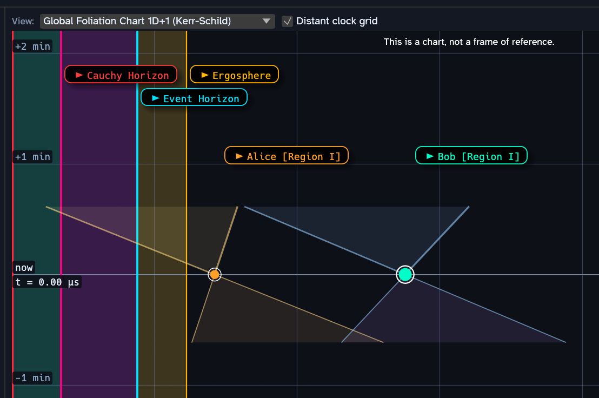
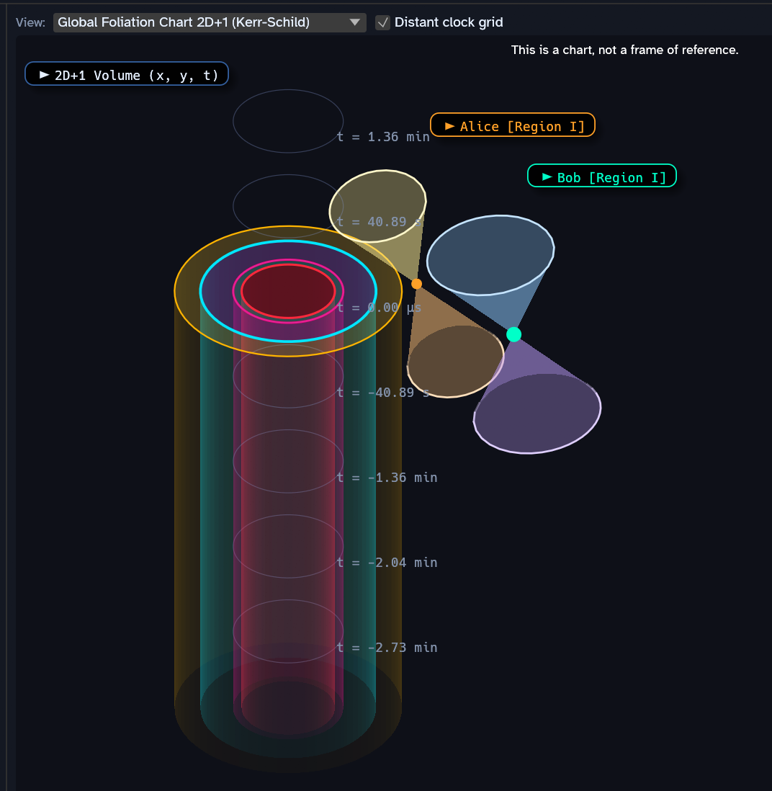
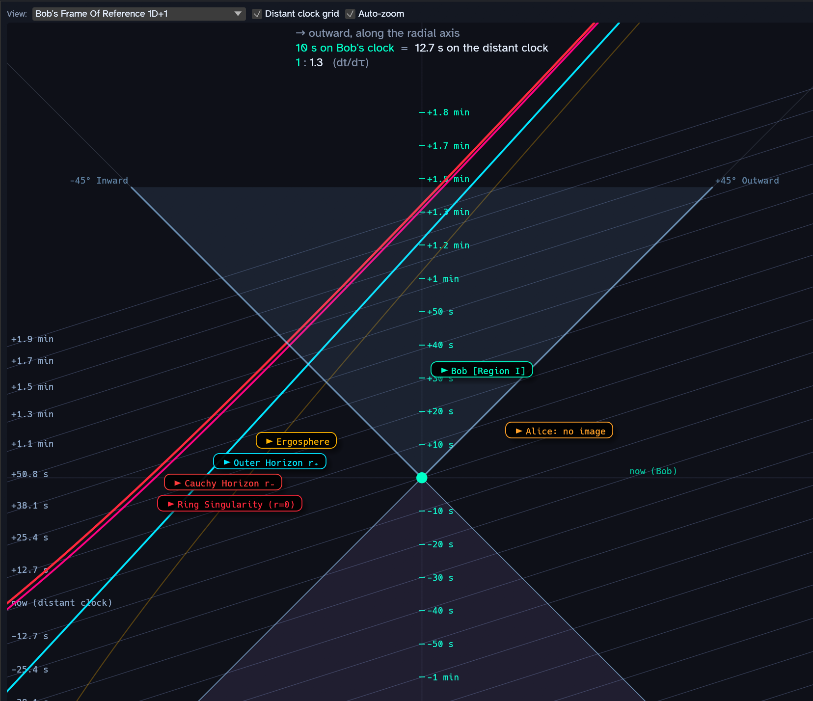

# BLACK HOLE LAB IS WORK IN PROGRESS

## Introduction

Black Hole Lab is a physics simulation of a rotating black hole and two
observers, Alice and Bob.  You can launch Alice and Bob on paths around or into
the black hole and watch events play out.  The simulation let's you see a slice
of the physics with one or two dimensions of space plus one of time.  Alice and
Bob also have a beacon that transmits a radio wave in all directions.  The
simulation calculates and shows the wavefront of these signals, accounting for
the warping of space and time by the black hole.  The simulation also records
whenever Alice and Bob receive a signal from the other.

The simulation takes pains to respect Einstein's equations of general
relativity.  To the precision of the numerical integration, the effects shown in
Black Hole Lab are really what the math of general relativity says will happen.
In some cases, the calculations stop at a limit, such as 10 billion for the
ratio of the distant clock to Alice and Bob's clock. While the predictions of
general relativity have been proven correct countless times, physicists agree
that general relativity *cannot* be the final word on black holes.  Nobody knows
yet what would *actually* happen to Alice and Bob inside a black hole.

## Starting Up

Black Hole Lab divides the screen into 3 parts.  On the left are most of the
settings.  In the middle is the selectable frame of reference (FoR) view or the
global "foliation" chart.  On the right is the 2 dimensional equatorial view.

## Basic Controls

To start, click **Play** in the top left.  You'll see Alice and Bob start moving
and broadcasting the their signal.  By default, Alice orbits the black hole
while Bob takes a rather uninteresting plunge inward.

Click **Reset** to return the simulation to its starting point.  You can also
play/pause the simulation with the space bar.  The keyboard arrow keys **single
step** the simulation forward and backward in time.

You can also save and load your simulation using the associated buttons.

## The Equatorial Plane View

The right hand side shows a top-down map of the black hole and surrounding
space.  The black hole looks like a colored bullseye while Alice and Bob are the
yellow and turquoise dots respectively.  The black hole spins counter-clockwise.

## The Frame of Reference View

The middle pane of Black Hole Lab is the frame of reference view.  You can
choose whether this pane shows Alice or Bob's frame of reference, or you can
show a 1D+1 or a 2D+1 "foliation" chart.  First, let's discuss what we mean by
"frame of reference".

### What is a Frame of Reference?

Your *frame of reference* (FoR) is your local reality where your experiments
measure the speed of light as `c` in all directions.  Your FoR is the all
important determinant of distance, time and the order of events.  For example,
two stopwatches in different FoRs could measure the same event as taking a
million years or a millisecond.  The universe has no preferred FoR, so neither
stopwatch is more correct than the other.

### Coordinate Time vs Proper Time

*Coordinate time* is the artificial "chart clock" used to step the mathematics
of the simulation.  Fudging just slightly, one second of coordinate time is our common notion of one second.

*Proper time* is the time measured in an observer's FoR, e.g. Bob's wristwatch.

To get a sense of the difference, imagine Bob falling into the black hole while
Alice observes from far away.  Let's compare Alice's proper time, Bob's proper time and the coordinate time.

* In her proper time, Alice sees Bob slow as he nears the event horizon and his
  watch ticking ever more slowly.  Wait as she might, Alice never sees Bob cross
  the horizon as his light becomes too stretched (redshifted) to detect.  To
  her, Bob's watch appears all but stopped.
* In his proper time, Bob dives through the event horizon and into the black
  hole at tremendous uninterrupted speed.  His watch says the whole trip took
  just a few minutes.
* In coordinate time, Bob moves smoothly across the event horizon without
  slowing down.

### Global Foliation Charts

The default view in the FoR pane is the `Global Foliation Chart 1D+1`.

The global foliation chart shows the simulation's view of events.  Notice the `1D+1` notation.  The `1D` means this view shows 1 dimension of space horizontally.  Physicists judiciously choose that dimension to be the distance to the center of the black hole.  The `+1` is the time dimension shown vertically.  Bob and Alice's FoR views share this `1D+1` style.

The other unique view is the **Global Foliation Chart 2D+1**

In this view, we get two dimensions of space like the Equatorial view, with time pointing vertically up.

### Bob and Alice's FoR

The last two options we can show are **Bob's Frame Of Reference 1D+1** and likewise for Alice.  These views show `1D+1` reality as measured by the observer.  The math gives us an oracle-like view since we can see places and events in the observer's *future*.  Of course a real Alice and Bob would only perceive their *now*.

### Light Cones

All the graphs above feature cone shapes centered on the observers.  These are
**light cones**.  Light cones provide a helpful way to reason about observers
and are common in diagrams on relativity.  The cone below the observer shows
spacetime where light from *any past event* can reach the observer.  The cone
above the observer shows the spacetime where light from *any future event* can
reach the observer.  As a universal convention, physicists use a 45 degree line
to represent the speed of light: the speed of light is one unit of space
horizontally for one unit of time vertically.

We pick on "light from an event" here, but this really means *any*
cause-and-effect influence whatsoever.  An event outside your light cone
*cannot* affect your reality in any way.

### Light Cone Tilting

If you look at the global foliation view above, you'll notice that Bob and
Alice's light cones appear a tilted toward the black hole.  This is a real
physical effect of the warping of spacetime by gravity.  It's quite fair to say
that gravity *pulls on your future*.

On the other hand, Bob's FoR view shows his light cone rigidly at 45 degrees.  From Bob's frame of reference, light moves at `c` in all directions.  Things might appear warped *within* Bob's light cone, but light itself moves unfailingly at `c` in an observer FoR.

Note that Bob's FoR is a proper *frame of reference* while the global foliation view that shows tilted light cones is a *chart* to help us understand.

### The Black Hole Ergosphere

The outermost yellow region of the black hole is the *ergosphere*.  A spinning
black hole pulls the very vacuum of space around in the direction of spin, a
phenomenon known as **frame dragging**.  Frame dragging affects space out to
great distances, but the ergosphere marks the boundary where dragging pulls
space *around* the black hole faster than the speed of light!  Objects can enter
and escape the ergosphere, but *nothing* can stay motionless there.

More details:
[Wikipedia](https://en.wikipedia.org/wiki/Ergosphere),
[Anton Petrov](https://www.youtube.com/watch?v=crnxcK2UazM),
[PBS Space Time](https://www.youtube.com/watch?v=UjgGdGzDFiM)

### The Black Hole Event Horizon (Region II)

Next inside the ergosphere is the light blue *event horizon*.  The event horizon
marks the boundary where the vacuum of space moves *into* the black hole faster
than the speed of light.  This is the point of no return!  An object can cross
the event horizon going in, but cannot cross back into *our* universe.  Crossing
the event horizon puts you in what physicists call `region II` of the black
hole.

Note that general relativity says spinning black holes have *two* event
horizons.  The horizon we're discussing here is the *outer horizon* that
physicists give the shorthand name `r+`.

To put it mildly, interesting things happen at the outer event horizon.  For
example, immediately after crossing, the event horizon stops being a place below
you and becomes a moment in your past!  Inside, time itself (your future) points
toward the middle of the black hole.  To get back out, you need rocket engines
strong enough to prevent tomorrow from happening.

Complicating matters, physicists debate whether general relativity is correct about the event horizon.  A future [Theory of
Everything](https://en.wikipedia.org/wiki/Theory_of_everything) could describe
very different physics there. See
[Fuzzballs](https://www.youtube.com/watch?v=351JCOvKcYw) and
[Firewalls](https://www.youtube.com/watch?v=4uQF9Egc-fM&t=14s) for example.
Black Hole Lab, being a general relativity simulation, inherits the **smooth no
drama** view.

### The Black Hole Inner (Cauchy) Horizon

The next magenta colored ring inside the event horizon is the Cauchy or inner
horizon.  This horizon exists in spinning black holes, which is probably every
real black hole in our universe.  Physicists use the shorthand name `r_` for the
inner horizon. If the outer horizon is strange, the inner horizon is bizarre.  A
few of the more mind-boggling aspects to think about:

* The inner horizon is the boundary where the arrow of time stops pointing
  strictly inward and tilts back to point into the future like normal space.

* Like the outer horizon, the inner horizon can be both a moment in time or a
  place in space depending on which side you find yourself.

* The inner horizon has two *branches*, so to speak. If you have high angular
  momentum, you'll encounter the branch where the inner horizon profoundly
  compresses incoming time.  As you get close, the outside universe appears to
  run ever faster relative to your clock.  In general relativity, this effect
  grows exponentially and without bound! Unfortunately for you, this time
  compression effect also gives incoming light an unbounded energy boost.
  Physicists refer to this phenomenon as "infinite blueshift". You fry in a bath
  of future light boosted to extreme energy.

  With low angular momentum, you fall through the first branch of the horizon.
  In this case, you don't linger from the outside universe's perspective.  You
  will unfortunately be fried by the "infinite blueshift" of light emitted from
  everything that fell in before you on this path.

Our understanding of the physics at this layer is even less clear than at the
outer event horizon.  As before, Black Hole Lab let's general relativity be the
only word on the physics.

### The Ring Singularity

If you cross the inner horizon you enter what physicists call `region III` of
the black hole.  This deep in a black hole arguably exists only in the math of
general relativity.  As in ancient maps with uncharted edges, "Here Be Dragons".

Below you in `region III` is the *ring singularity*.  In the math, the ring
singularity contains the mass of the black hole in a skinny spinning donut of
infinite density.  In Black Hole Lab, the ring singularity is mathematically
radius r = 0.  In `region III`, the arrow of time once again points toward the
future and an observer can move around in 3 dimensions.

If you enter `region III` with enough angular momentum, you swing back out
toward the inner horizon, but this time asymptotically approaching from below.

### Radio Waves

The orange rings around Alice and Bob show the propagation of their radio
signals, which travel at the speed of light.  Notice how the black hole tugs
strongly on Alice's signal

